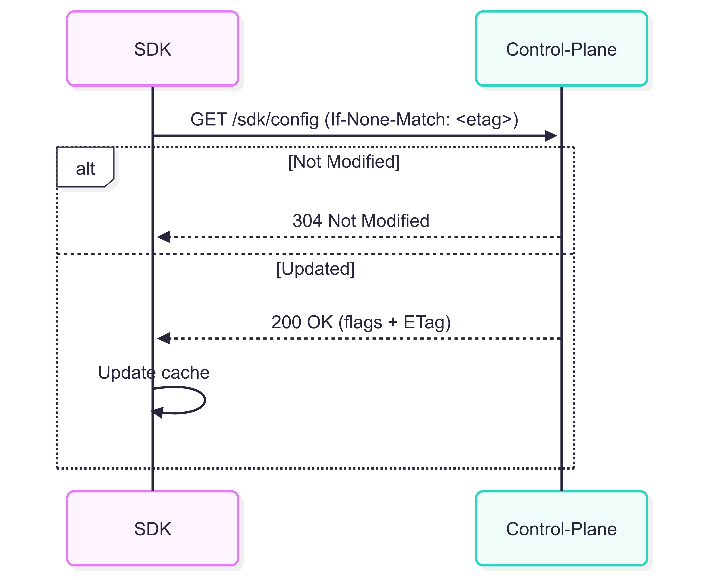
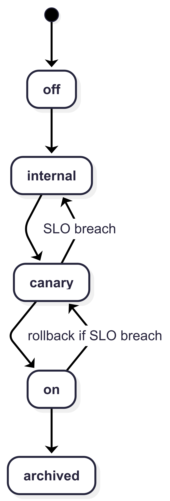

# ADR-000: Feature Flags with Auto-Canary Guardrails

**Decision:** Build a control-plane + SDK that performs percentage rollouts with SLO-based auto-rollback, observable via OpenTelemetry, backed by Postgres.

## Context
Teams need to ship features safely across web/mobile. Today rollouts are all-or-nothing and manual, causing risk and slow recovery.

## Goals
- Toggle features per app/environment.
- Roll out by % and segments; **auto-rollback** if error/latency SLOs breach.
- SDK provides low-latency, cached evaluation (offline-tolerant).
- First-class observability (traces/metrics/logs) and auditability.

## Non-Goals
- Full multi-tenant admin UI (CLI + API only in v1).
- Rule language beyond simple attributes (advanced targeting later).
- Long-term analytics/experimentation (A/B stats out of scope).

## Requirements
**Functional**
- CRUD flags; states: off → internal → canary → on → archived.
- Percentage rollout; optional segment targeting (country, appVersion).
- SDK bootstrap + delta refresh (ETag/If-None-Match, backoff).
- Auto-rollback to prior safe state on SLO breach; write audit log.

**Non-Functional**
- Control-plane p95 < 150ms; SDK eval p95 < 10ms in-proc.
- Rollback time < 2 min from breach detection.
- 99.9% “demo” availability (dev environment).
- Postgres for persistence; migrations tracked in repo.

## APIs (v1)

### Control Plane
```
POST /flags
GET  /flags/{key}
PUT  /flags/{key}
GET  /healthz
```

**Flag JSON**
```json
{
  "key": "new_home",
  "type": "boolean",            // boolean | percentage | multivariant
  "state": "canary",            // off|internal|canary|on|archived
  "rollout": { "percentage": 5, "segments": ["beta_testers"] },
  "description": "New home screen",
  "owner": "mobile-team"
}
```

### SDK Config
`GET /sdk/config?appId={id}&etag={optional}`
- Returns current flags + ETag; server supports ETag and 304.
- Client long-polls or backs off when 304.

### Events (optional v1)
`POST /events/evaluations  // sampled client eval events (for future insight)`

## Data Model (Postgres)

```
- flags(
    id bigserial PK,
    key text UNIQUE,
    type text,           -- boolean|percentage|multivariant
    state text,          -- off|internal|canary|on|archived
    rollout jsonb,       -- {percentage:int, segments:[text], rules:[...]}
    description text,
    owner text,
    tags text[],
    created_at timestamptz default now(),
    updated_at timestamptz default now())

- audit_logs(
    id bigserial PK,
    flag_key text,
    actor text,
    action text,         -- create|update|rollback
    before jsonb,
    after jsonb,
    created_at timestamptz default now())
```

## Rollout State Machine
off → internal → canary (1%→5%→25%) → on → archived

**Transitions**
- internal→canary: requires SLOs defined and dashboards active.
- canary→on: only if SLOs stable for N minutes under canary traffic.
- any→previous: automatic rollback on breach.

**Breach & Rollback**
- Breach if (error_rate_5m > 1.5×baseline) OR (p95_latency_5m > 1.3×baseline) for 2 consecutive windows.
- Evaluator writes audit log, flips state to previous, emits event “rollback”.
- Mean rollback time target: < 2 min.

## SDK Evaluation (v1)
- Maintain in-memory cache keyed by flag key.
- Fetch via /sdk/config with ETag; on 304, keep cache; on 200, refresh.
- Percentage rollout: consistent hashing
  bucket = hash(userId + flagKey) mod 100
  enabled if bucket < rollout.percentage
- Targeting: optional simple predicates (country, appVersion).
- Offline mode: use last-known-good cache with TTL and jitter.
- Telemetry: histogram of eval time; cache hit ratio; stale reads count.

## Observability
**Traces**
- span: http.server (control-plane endpoints)
- span: sdk.eval (attributes: flagKey, rule, result)

**Metrics**
- request_count{route,status}, error_rate, p50/p95/p99 latency
- sdk_eval_latency, cache_hit_ratio, rollback_count
- slo_burn_rate (recorded for canaries)

**Logs**
- state transitions, rollback decisions (with reasons)

**Dashboards**
- Latency histograms + error budget
- Canary vs. control cohorts (if events enabled)

## Security & Privacy
- Secrets via environment/parameter store; never commit secrets.
- SDK config contains no PII; client identifiers are hashed before use.
- Audit logs on create/update/rollback with actor and diff.
- SBOM & provenance notes generated in CI before release (v1.0 milestone).

## Risks & Tradeoffs
- JSONB rollout schema is flexible but less type-safe (mitigate with validation).
- No UI yet—CLI/API only (mitigate with Postman collection + demo script).
- Simple targeting language (mitigate by documenting extensibility points).
- Dev-only SLOs; production SLOs to be defined if adopted.

## Milestones
M1 Core: control-plane CRUD + Postgres + /healthz + OTel wiring
M2 SDK .NET v0.1 (bootstrap + cache + percentage hashing)
M3 Auto-Canary evaluator + rollback + dashboards
M4 iOS sample app + offline fallback
M5 Chaos day + postmortem + demo video v1
M6 Security pass (SBOM/provenance) + v1.0 release

## Open Questions
- Minimum viable targeting predicates for v1?
- Long-poll vs. SSE for SDK refresh—any platform constraints?
- Where to store baseline SLOs per flag/environment?

## Review Checklist
- [ ] APIs cover CRUD + SDK config with ETag
- [ ] Rollout states and rollback thresholds make sense
- [ ] Data model supports auditability
- [ ] SLOs observable in dashboards
- [ ] Risks acknowledged with mitigation path

## Diagrams
### Sequence Diagram (SDK refresh + ETag)


### State machine
