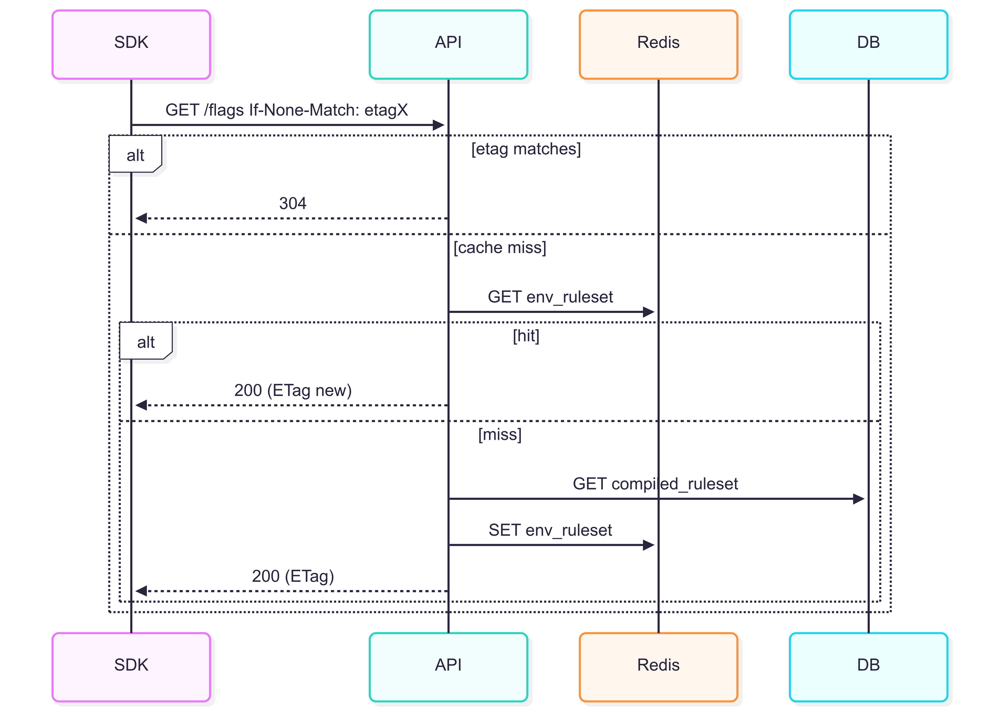

# 1. Requirements 

* **Goal:** Serve SDKs `GET /environments/{env}/flags` efficiently with ETag caching.
* **Consumers:** mobile + server SDKs polling every 60s (configurable).
* **Read SLOs:** p95 ≤ **50ms** (cache hit), p95 ≤ **200ms** (DB hit), availability ≥ **99.9%**.
* **Write SLOs:** flag change visible to reads ≤ **5s** (eventual consistency ok).
* **Scale assumption (today):** 500k active clients, poll/60s ⇒ **\~8.3k RPS** peak; aim for **≥95%** cache hit.
* **Consistency:** clients see a self-consistent ruleset (versioned); eventual across clients is fine.
* **Security/Privacy:** environment key for reads, no PII in payload; gzip enabled.
* **Out of scope (today):** streaming updates, multitenancy isolation beyond env keys.

# 2. API sketch

```yaml
GET /environments/{env}/flags
Headers: 
  X-Env-Key: <key> (required)
  If-None-Match: "<etag>" (optional)
Responses:
  200 OK 
    ETag: "<etag>"
    Cache-Control: private, max-age=60
    Body: { version, updatedAt, flags: [ { key, variants, default, rules:[...] } ] }
  304 Not Modified (no body)
Error responses: 401 (bad env key), 429 (rate limit)
```

# 3. Data model & indexes 

* Tables: `environments(id, name)`, `flags(env_id, key, variants, enabled, version, updated_at, etag)`, `flag_rules(flag_id, priority, segment, percentage, variant)`.
* **Indexes:**

  * `flags(env_id)` (covering: `key, enabled, etag, updated_at, version`)
  * `flag_rules(flag_id, priority)`
* **Materialization:** build a **compiled ruleset JSON** per env after writes and store it (row or object storage). Read path then fetches a single blob by `env_id`.
* **ETag/version source:** compute when materializing; write both to `flags` and the compiled blob row.

# 4. Caching & flow 

Design:

* **In-proc cache** (per instance): `env_ruleset:{env}` → `{etag, version, json, lastRefreshed}`. TTL \~60s.
* **Redis cache** (shared): same key/value for cross-instance hits; TTL \~5–10 minutes.
* **Write → invalidate:** after any change, publish an **“env\_changed:{env}”** message; API instances subscribe and evict in-proc; also update Redis immediately.
* **Read algorithm:**

  1. If request has `If-None-Match` and equals in-proc `etag` ⇒ respond **304** (no body).
  2. Else, try in-proc cache. If miss, try Redis. If miss, **singleflight** DB/compiled-blob fetch → repopulate caches.
  3. Always send `ETag` with 200.
* **Backpressure:** guard singleflight with a small semaphore per env to avoid a thundering herd on cold starts.
* **Rate limiting:** token bucket per env key (e.g., 120 req/min burst 60), return **429** politely.



# 5. Ops & guardrails hook


- **Health:** `/healthz` + **readiness** checks Redis connectivity & DB; refuse traffic if cold.
- **Observability:** OTel traces for `GET /flags`; metrics: request count, duration histogram, 304 ratio; label by env.
- **Error budgets:** Read p95 and error-rate show on Grafana (you already wired this in your flagship).
- **Rollout evaluator tie-in:** When a flag changes (rollout advances/rolls back), the **materializer** updates compiled blob → bumps `etag` → SDK polls → picks up new rules next minute. That’s your 5s–60s freshness path.
- **Runbook excerpt:** “If Redis down: expect +150ms p95; increase instance count or temporarily increase SDK poll interval via config; watch error budget.”

# 6. Risks, tradeoffs, next steps 

- **Risk:** compiled blob staleness if materializer fails → **Mitigation:** write to blob & `flags` in one transaction; healthcheck fails if versions disagree.
- **Tradeoff:** polling vs streaming. **Why polling now:** simpler, debuggable, plays well with ETag/CDN later.
- **Next steps:**  
   - Add CDN cache for `/flags` for web clients (vary by env).  
     - [ ] #1 CDN cache for /flags
   - Add **SSE** as an optional push path for low-latency changes.  
     - [ ] #2 SSE push channel
   - Add **tenant partitioning** (env key namespaces) if multi-tenant.

# Acceptance criteria 
Tick these before you leave the block:

- [x] Doc saved at `docs/drills/2025-08-11-read-path.md` with sections 1–6 completed.  
- [x] Mermaid sequence diagram rendered on GitHub (or a PNG dropped in).  
- [x] Two issues created from “Next steps.”  
- [ ] A **10-minute screen recording** where you talk through the 4-box + caching flow.
