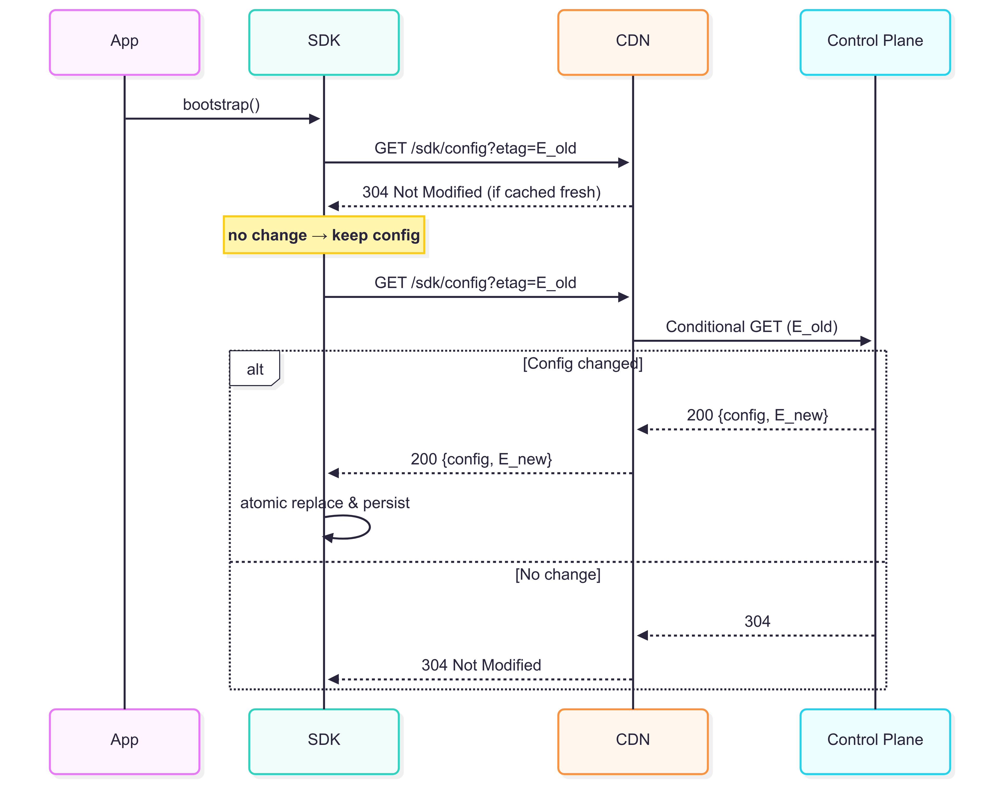
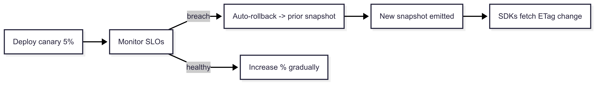

# SDK Cache Coherence — System Design Drill (2025-08-12)

Scenario: Mobile/desktop apps need fresh flag configs without hammering the control plane. We’ll design the client update strategy (bootstrap, refresh, backoff, staleness bounds), not the whole system.

One-liner: “Build an SDK that fetches a versioned config, keeps it fresh with minimal load, and guarantees bounded staleness and safe rollback.”

## 1) Requirements
**Functional**

* Bootstrap config on app start; evaluate flags locally (no per-call RPCs).
* Refresh config in background; update atomically.
* Support percentage rollouts & segments (cohorting by user attributes).
* Respect **server ETag** (or version) and return **304 Not Modified** on no change.

**Non-goals (for v1)**

* No multi-tenant UI.
* No client-side rule language execution beyond basic operators (we’ll precompile on server if needed later).

**SLOs / Success metrics**

* SDK eval p95 **< 10ms** (in-proc).
* Staleness bound **≤ 60s** during steady state (config changes visible within a minute).
* Control-plane p95 **< 150ms** for `/sdk/config`.
* **Auto-rollback visible ≤ 2m** from SLO breach (hooked to your canary evaluator).

**Constraints / realities**

* Clients may be offline; must use last-known-good (LKG) config on disk.
* Spiky traffic at app cold start; must avoid thundering herds.

**Why it matters**

* This is the thin waist between product velocity and reliability—you enable safe shipping without paging SRE every rollout.

## 2) API & Client Protocol

**HTTP endpoints**

```
GET /sdk/config?appId={id}&etag={optional}
# returns 200 with JSON + ETag header when changed, else 304 Not Modified
POST /events/evaluations    # optional, sampled client eval events (later)
GET  /healthz
```

**Headers & caching**

* **ETag:** strong hash of current config snapshot (e.g., SHA256 over canonical JSON).
* **Cache-Control:** `max-age=30` (clients still long-poll; this helps proxies/CDN).

**Payload (example)**

```json
{
  "version": "1742",              // monotonic
  "generatedAt": "2025-08-12T13:30:00Z",
  "flags": [
    {
      "key": "new_home",
      "type": "boolean",
      "state": "canary",          // off|internal|canary|on|archived
      "rollout": { "percentage": 5, "segments": ["beta_testers"] },
      "rules": [{ "attr":"appVersion","op":">=","value":"2.3.0"}],
      "default": false
    }
  ],
  "segments": { "beta_testers": { "userIds": ["u1","u2"], "predicate": null } }
}
```

**Client algorithm**

```pseudo
state:
  lkg_config = read_disk_or_empty()
  etag = lkg_config.etag or ""
  backoff = 1s, max 60s

function bootstrap():
  apply(lkg_config)
  spawn refresh_loop()

function refresh_loop():
  while app_running:
    resp = GET /sdk/config?appId=A&etag=etag   # 304 or 200
    if resp.status == 200:
      new = resp.body
      atomically_replace_in_memory(new)
      write_to_disk(new)
      etag = resp.headers["ETag"]
      backoff = 1s                       # reset on success
    else if resp.status in [304]:
      // no change
    else:
      // network/server error; keep LKG
      backoff = min(backoff * 2, 60s)
    sleep(jitter(backoff, ±20%))

function evalFlag(key, context):
  // pure function over in-memory config + context hash bucketing
  // ensure deterministic bucketing: hash(userId + key) % 100 < percentage
```

**Why it matters**

* ETag + 304 prevents redundant payloads—cheap consistency.
* **Atomic replace** avoids torn reads (readers always see either old or new snapshot).
* **Exponential backoff + jitter** avoids synchronized retries (thundering herd).
* **LKG on disk** gives offline resilience.

## 3) Data Model (Server)
**Tables (Postgres)**

* `flags(id PK, key UNIQUE, type, state, rollout jsonb, description, owner, tags text[], created_at, updated_at)`
* `config_snapshots(version BIGINT PK, etag TEXT UNIQUE, json JSONB, created_at)`
* `audit_logs(id PK, actor, action, flag_key, before JSONB, after JSONB, created_at)`

**Config generation**

* On any flag change, **create immutable snapshot**, compute `etag`, store JSON.
* `/sdk/config` serves the **latest snapshot** (by `version`), conditional on ETag.

**Why this shape**

* Immutable snapshots make rollbacks and diffs trivial.
* ETag from snapshot ensures deterministic cache semantics across regions.

## 4) Scale / Availability / Ops
**Traffic & scaling**

* Put `/sdk/config` behind CDN/edge with **short TTL (e.g., 30s)**.
* Use **request coalescing** (origin only renders one snapshot per ETag).

**Consistency model**

* **Eventual with bounded staleness:** aim ≤ 60s for “most clients updated.”
* For **canary rollouts**, clients must converge fast—consider **SSE/long-poll** as an upgrade path if you need <10s latency.

**Invalidation**

* On new snapshot: publish `etag` to a Redis/Kafka channel (future); **clients still rely on polling** today to keep SDK simple.

**Reliability**

* **Circuit breaker** in SDK for repeated 5xx; keep serving LKG.
* **Auto-rollback** triggered by your canary evaluator: set state back; server emits new snapshot; SDKs pick it up on next refresh.

**Security**

* Signed responses (optional) + HTTPS, **no secrets in config**.
* Attribute hashing on client to avoid shipping PII.

**Observability (your demo)**

* Traces: `/sdk/config` span with `etag.old`, `etag.new`.
* Metrics: request rate, hit ratio (304%), p95 latency, error rate.
* Logs: rollback decisions + snapshot version.

**Capacity planning (talk track)**

* Assume 100k DAU; cold start spike at 9am = 10k RPS for 5 min.
* CDN absorbs 90% with ETag/304; origin sees \~1k RPS burst—size accordingly.

## Diagrams

### Sequence Diagram (client refresh path)



### Flowchart (rollout/rollback flow)



## Tradeoffs & next steps

* **Why polling over push?** Simpler client; bounded staleness is OK for flags.
* **When to upgrade to SSE/WS?** If you need sub-10s convergence.
* **Risks:** skewed cohorts if hashing changes; mitigate with stable salts.
* **Next:** cohort stickiness tests, chaos drill (drop origin), demo dashboards.